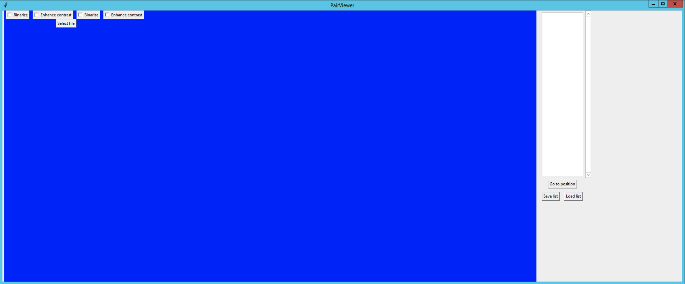

# SegViewer
A python-based GUI that visualises image and matching segmentation mask side-by-side

# Installation
No installation required. Just clone github repository.

# Running PairViewer
1. Execute `pairviewer.py` in your terminal:

```bash
python ./pairviewer.py
```



2. Use the `Select file` button to open a `.csv` file containing paths to pairs of images. Example:

|                        |                        |
|----------------------- | -----------------------|
|`/path/to/image/1a.png` | `/path/to/image/1b.png`|
|`/path/to/image/2a.png` | `/path/to/image/2b.png`|
|`/path/to/image/3a.png` | `/path/to/image/3b.png`|
|`...`                   | `...`                  |

Note: For Schroeder Lab movies use 8bit movies with well-set black-point and white-point for good contrast
images.

3. 
