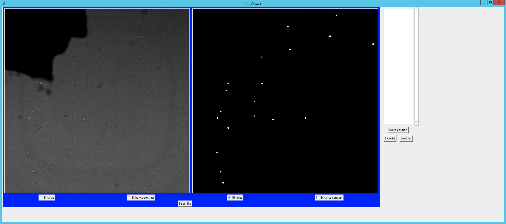

# SegViewer
A python-based GUI that visualises image and matching segmentation mask side-by-side

## Installation
No installation required. Just clone github repository.

## Manual
1. Execute `pairviewer.py` in your terminal:

```bash
python ./pairviewer.py
```


\
\
\
2. Use the `Select file` button to open a `.csv` file containing paths to pairs of images (see `example_list.csv`). Format example:

|                        |                        |
|----------------------- | -----------------------|
|`/path/to/image/1a.png` | `/path/to/image/1b.png`|
|`/path/to/image/2a.png` | `/path/to/image/2b.png`|
|`/path/to/image/3a.png` | `/path/to/image/3b.png`|
|`...`                   | `...`                  |


Note: For Schroeder Lab movies use 8bit movies with well-set black-point and white-point for good contrast
images.
\
\
\
3. Navigate through image pairs using left (&#8592;) and right (&#8594;) arrow on your keyboard


\
\
\
4. Image pairs can be marked using upward (&#8593;) arrow on your keyboard. Marked image pairs are highlighted by
   a red border and the index of marked image pairs will be denoted in the list on the right. To unmark a marked
   pair of images, use the downward (&#8595;) arrow on your keyboard.


\
\
\
5. The list of marked images can be saved (same format as in 2.) to a `.csv` file using the `Save list` button.


Note: When saving a file do not enter the file suffix. It will be added automatically.\
Note2: Save a list after marking an image. Step 7. will allow you to continue where you left off.
\
\
\
6. Continue working on an existing list of marked images using the `Load list` button.


Note: Loading a list of marked images requires loaded image pairs (see 2.).
\
\
\
7. Use the `Go to position` button to move between marked pairs. Select the position you want to move to in the
   list on the right and click `Go to position`.


## ToDo
- [x] everything perfect
